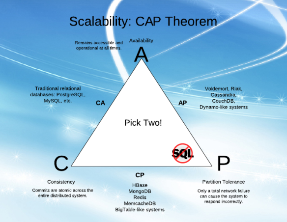

# The CAP Theorem

The CAP Theorem is a highly misunderstood theorem.

First of all, the CAP theorem is about data replicating between nodes in a distributed system.
That is, if you are not doing data replication, then the CAP theorem is not relevant.

It is usually depicted like this:

You are told to pick two out of three.

This is however not correct.
You cannot give up Partition Tolerance.
Being Consistent AND Available at the same time would mean that your system somehow manages to 
synchronize data between nodes even in the case of a network failure.
You simply cannot be disconnected and still communicate.

Instead, you should see this as a "Pick one out of two".
Either your system is "Consistent and Partition Tolerant", or, it is "Available and Partition Tolerant".

It should also be noted that the tradeoff here is only relevant during a network partition.
If the systems are connected and can communicate, you can of-course be both consistent and available.

Relevant reading:
* [https://martin.kleppmann.com/2015/05/11/please-stop-calling-databases-cp-or-ap.html](https://martin.kleppmann.com/2015/05/11/please-stop-calling-databases-cp-or-ap.html)
* [https://codahale.com/you-cant-sacrifice-partition-tolerance/](https://codahale.com/you-cant-sacrifice-partition-tolerance/)
