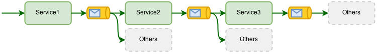
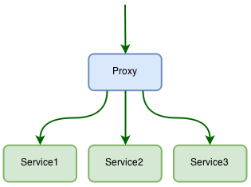
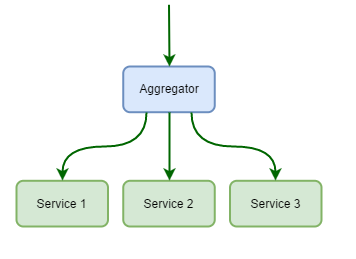
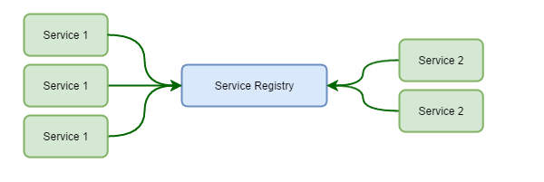

# Orchestrating Services

## Domain Events

One of the dominant approaches for this is to use domain events.
Each service publish events regarding what have happened and other services can subscribe to those events. 
This goes hand in hand with the concept of smart endpoints, dumb pipes that is described by Martin Fowler here: http://martinfowler.com/articles/microservices.html#SmartEndpointsAndDumbPipes

## Proxy

Another common apporach is to wrap the business flow in its own service. 
The proxy orchestrates the interaction between the microservices like shown in the below picture:

## Aggregator

Similar to the Proxy pattern, is the Aggregator.
The difference here is the intent rather than implementation.
In an aggregator, you commonly receive a request and fork out to other sub services.
The result of those calls are then aggregated into a response containing the relevant data for the aggregator.
This can save the client from making multiple calls to different services.

## Service Discovery

Service Discovery makes it possible for services to find other services by name.
It acts as a live updating registry of healthy service instances.
Service A can make a call to the service registry and ask for the location of service B.

